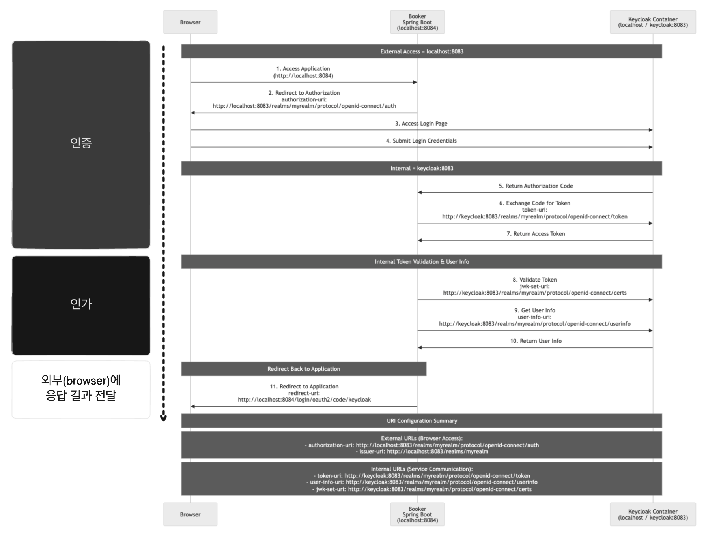

# 📚 Booker - 도서 관리 시스템

Keycloak 기반 인증/인가 시스템과 Google OAuth 연동을 지원하는 마이크로서비스 아키텍처의 도서 관리 시스템입니다.

## 🏗️ 아키텍처

### 토큰 분리 아키텍처
- **클라이언트(브라우저)**: Keycloak과 직접 통신, 토큰 관리
- **Keycloak**: 중앙집중식 인증/인가 서버 (Google OAuth 지원)
- **Spring Boot**: 토큰 없이 인가 정보만 받는 API 서버



## 🚀 빠른 시작

### 1. Google OAuth 설정 (선택사항)

```bash
# Google OAuth 설정 도우미 실행
./setup-google-oauth.sh
```

또는 수동 설정:

1. [Google Cloud Console](https://console.cloud.google.com/apis/credentials)에서 OAuth 2.0 클라이언트 ID 생성
2. 승인된 리다이렉션 URI 추가: `http://localhost:8083/realms/myrealm/broker/google/endpoint`
3. 환경변수 설정:
```bash
export GOOGLE_CLIENT_ID='your-google-client-id'
export GOOGLE_CLIENT_SECRET='your-google-client-secret'
```

### 2. 서비스 실행

```bash
# Docker Compose로 전체 서비스 실행
docker-compose up -d

# 또는 Google OAuth와 함께 실행
GOOGLE_CLIENT_ID='your-id' GOOGLE_CLIENT_SECRET='your-secret' docker-compose up -d
```

### 3. 접속 정보

- **Keycloak Admin**: http://localhost:8083/admin
  - ID: `keycloak_admin` / PW: `keycloak_admin_password123!`
- **Keycloak User**: http://localhost:8083/realms/myrealm/account
- **Spring Boot API**: http://localhost:8084/swagger-ui.html
- **테스트 클라이언트**: `client-example.html`

## 🔐 인증 방법

### 1. 기본 사용자 로그인
- 사용자명: `testuser`
- 비밀번호: `testuser`

### 2. Google OAuth 로그인
- Keycloak 로그인 페이지에서 "google" 버튼 클릭
- Google 계정으로 로그인

## 🛠️ 개발 환경 설정

### 환경구성
[ARM CPU 플랫폼, Java 런타임(JDK) 선택](wiki/00_setting/OpenJDK_VENDOR_CARRETTO.md)

### 서비스 구성
- **PostgreSQL** (5432): Keycloak 데이터베이스
- **MySQL** (3308): Booker 애플리케이션 데이터베이스
- **Keycloak** (8083): 인증/인가 서버
- **Spring Boot** (8084): API 서버

## 📝 API 사용법

### 클라이언트에서 API 호출

```javascript
// 1. Keycloak에서 사용자 정보 조회
const userInfo = await fetch(`${KEYCLOAK_URL}/realms/${REALM}/protocol/openid-connect/userinfo`, {
    headers: { 'Authorization': `Bearer ${accessToken}` }
});

// 2. Spring API 호출 (토큰 없이 사용자 정보만 헤더로 전달)
const response = await fetch(`${SPRING_API_URL}/api/books`, {
    headers: {
        'X-User-ID': userInfo.sub,
        'X-User-Email': userInfo.email,
        'X-Username': userInfo.preferred_username,
        'X-Roles': userInfo.realm_access?.roles?.join(',') || 'USER'
    }
});
```

## 🔧 주요 특징

- ✅ **토큰 완전 분리**: Spring 서버는 JWT 토큰을 받지 않음
- ✅ **Google OAuth 지원**: 소셜 로그인 연동
- ✅ **중앙집중 인증**: Keycloak에서만 토큰 관리
- ✅ **역할 기반 인가**: 사용자 역할에 따른 API 접근 제어
- ✅ **Swagger 통합**: OAuth2 흐름으로 API 테스트 가능

## 📚 문서

- [Keycloak 네트워킹](wiki/01_keycloak/KEYCLOAK_DOCKER_NETWORKING.md)
- [인증 시스템 이슈](ISSUE_AUTHENTICATION_SYSTEM.md)
