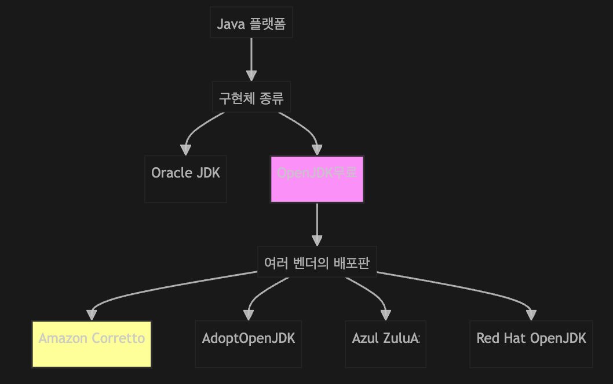

- [🎯 Problem-Solving 🎯](#🎯-problem-solving-🎯)
  - [AWS EC2 환경, Java 런타임(JDK) 선택](#AWS-EC2-환경-Java-런타임JDK-선택)
- [[구현]](#구현)
- [[개념학습] JDK 종류 및 선택 기준](#개념학습-jdk-종류-및-선택-기준)
  - [히스토리](#히스토리)
  - [JDK 표준](#JDK-표준)
  - [프로젝트에 맞는 JDK 선택](#프로젝트에-맞는-JDK-선택)
  - [주의사항](#주의사항)
- [[개념학습] 상업적 지원(Commercial Support)](#개념학습-상업적-지원commercial-support)
  - [히스토리](#히스토리-1)
  - [비용](#비용)
  - [어떤 프로젝트에서 사용?](#어떤-프로젝트에서-사용-1)
  - [주의사항](#주의사항-1)

# **🎯 Problem-Solving 🎯**

## AWS EC2 환경, Java 런타임(JDK) 선택
`기술적 목표` | AWS EC2에 배포할 개인 프로젝트의 Java 런타임(JDK) 선택  
`비즈니스적 목표` | 비용 효율성, 장기적 유지보수성, 안정성

**SITUATION**  
- 프로젝트 배포 전후 각 각, 동일하게 사용할 JDK 선택 필요  
(Oracle JDK, OpenJDK, Amazon Corretto...)  
- 개인 노트북 (개발활경) = aarch64 _ M2 ARM 칩(64비트/ARMv8-A 이상)

**PROBLEM**  
- 프로젝트 시작전, 이후 불필요한 유지보수를 피하기 위해 적절한 JDK 선택필요
- 배포 / 로컬 플랫폼 호환성, AWS 환경 비용 최적화, 보안 패치 등.. 조사 진행

**SOLUTION**  
`선택 사항` | Amazon Corretto 17 aarch64
- **JDK 구현체**: Amazon Corretto
- **버전**: 17 LTS (Long Term Support)
- **아키텍처**: aarch64 (ARM 64비트) 

`선택이유` | 

[ Amazon Corretto ] 배포환경_AWS 최적화, LTS, 빠른 보안 패치  
[ aarch64 ] ARM 환경에서, 불필요한 x86 에뮬레이션 과정 제거 → 성능향상
- 작업환경 | Apple Silicon(M1/M2) : 개발환경 / AWS Graviton CPU : 운영환경  
- x86 JDK → ARM 환경에서 x86 머신코드 연산필요   
→ Rosetta 2 x86 에뮬레이션 발생 → 추가 작업 → 서버성능에 영향
- aarch64 JDK → JVM JIT 컴파일러가 바이트코드를 ARM 머신코드 변환 → ARM CPU 연산  
(추가 에뮬레이션 작업 X)
- ARM 작업환경에 맞는 aarch64 JDK 선택  

[ 17 ver ]  
Java 21이 최신이지만, 아직 생태계가 완전히 안정화되지 않았고,   
Java 17은 시간이 지난만큼 생태계가 성숙 + 관련 자료 다수 + arm 친화적 ver

-- 성능 : [OpenJDK JEP 391](https://openjdk.org/jeps/415)
- 17 버전 또한 ARM 최적화 설계

-- 설계 
- Sealed Classes (봉인 클래스) - [OpenJDK JEP 409: Sealed Classes](https://openjdk.org/jeps/409)
  - 상속 구조를 더 명확하게 제어
  - 타입 안정성 향상
- Record Classes
  - 불변 데이터 객체를 위한 간결한 문법
  - DTO, Value Object 작성 용이


**LEARNED**  
- 플랫폼(CPU/OS) 환경에 맞는 라이브러리 선택 → 성능 향상에 직결됨 이해

<br><br>

# **[구현]**
Amazon Corretto 17 LTS 설치  
```
~/Documents/booker main*
base ❯ java -version                                             
openjdk version "17.0.15" 2025-04-15 LTS
OpenJDK Runtime Environment Corretto-17.0.15.6.1 (build 17.0.15+6-LTS)
OpenJDK 64-Bit Server VM Corretto-17.0.15.6.1 (build 17.0.15+6-LTS, mixed mode, sharing)
```


<br><br><br><br>

# **[개념학습] JDK 종류 및 선택 기준**
## 히스토리
- Java는 오라클이 공식적으로 Oracle JDK를 배포  
- 오픈소스화 이후 OpenJDK가 표준 구현체로 자리잡음  
- AWS, Azul 등 다양한 벤더가 OpenJDK 기반 배포판 제공




| JDK 종류 | 표준 준수 | 지원/관리 주체 | 라이선스/비용 | 특징 및 장점 |
|--------------------|-----------|---------------------|-------------------|-------------------------------------|
| Oracle JDK | O | Oracle(오라클) | 유료(11버전~) | 상업적 지원, 기업용, 안정성 |
| Azul Zulu | O | Azul Systems | 무료/유료(상업지원)| 상업적 지원 옵션, 다양한 플랫폼 지원 |
| OpenJDK | O | 커뮤니티/여러 벤더 | 무료, 오픈소스 | 표준 구현, 다양한 벤더, 유연성 |
| Amazon Corretto| O | AWS(아마존) | 무료 | AWS 최적화, LTS, 빠른 보안 패치 |
| Temurin | O | Adoptium 커뮤니티 | 무료 | 커뮤니티 주도, 다양한 OS 지원 |


## 프로젝트에 맞는 JDK 선택
  - 기업/상업: Oracle JDK, Corretto, Zulu  
  - 오픈소스/개인: Corretto, OpenJDK, Temurin  
  - AWS 환경: Corretto  
  - 다양한 OS/플랫폼: Temurin

## 주의사항
- 로컬과 배포서버의 JDK 버전 반드시 일치  
- LTS(Long Term Support) 버전 사용 권장(17, 21 등)  
- 상업적 지원 필요시 벤더 선택 신중  
- AWS EC2에서는 Corretto가 설치/관리 편리

<br><br><br><br>

# **[개념학습] 상업적 지원(Commercial Support)**

## 히스토리
- 오픈소스 널리 보급 -> 기업들은 무료 소프트웨어의 안정적 운영과 장애 대응에 대한 필요성을 느낌
- 이에 따라 소프트웨어 벤더(Oracle, Red Hat, Azul 등)는 유료로 상업적 지원 서비스를 제공
- Oracle JDK는 11버전 이후 상업적 지원이 유료화됨

- 상업적 지원은 단순 소프트웨어 배포가 아니라,  
  **보안 패치, 버그 수정, 기술 지원, 장기 지원(LTS), 컨설팅, 법적 보호** 등 다양한 서비스로 구성

## 비용
- **상업적 지원 JDK**
  - **Oracle JDK**: 서버 1대당 월 $25 | [Oracle 공식 가격표](https://www.oracle.com/java/technologies/downloads/java-se-subscription-pricelist.html)
  - **Azul Zulu**: 서버 1대당 월 $25 | [Azul 공식 가격표](https://www.azul.com/products/pricing/)
  - **Red Hat OpenJDK**: RHEL 구독에 포함(별도 JDK 비용 없음) | [Red Hat 공식 사이트](https://access.redhat.com/products/openjdk)
- **비상업적 지원 JDK**
  - **Amazon Corretto, Eclipse Temurin**:  
    - 무료  
    - [Amazon Corretto 공식 사이트](https://aws.amazon.com/corretto/)  
    - [Eclipse Temurin 공식 사이트](https://adoptium.net/)

## 어떤 프로젝트에서 사용?
  - 상업적 지원: 기업, 공공기관, 미션 크리티컬 서비스, 법적 책임이 중요한 환경
  - 비상업적 지원: 개인, 스타트업, 비영리, 실험적/연구 프로젝트

## 주의사항
- SLA, 지원 범위, 지원 기간 등 계약 조건을 꼼꼼히 확인 필요
- 무료 JDK 사용 시, 보안 패치 및 장애 대응을 스스로 책임져야 함
- 상업적 지원이 필요한지, 프로젝트 특성에 따라 신중히 판단해야 함

---
