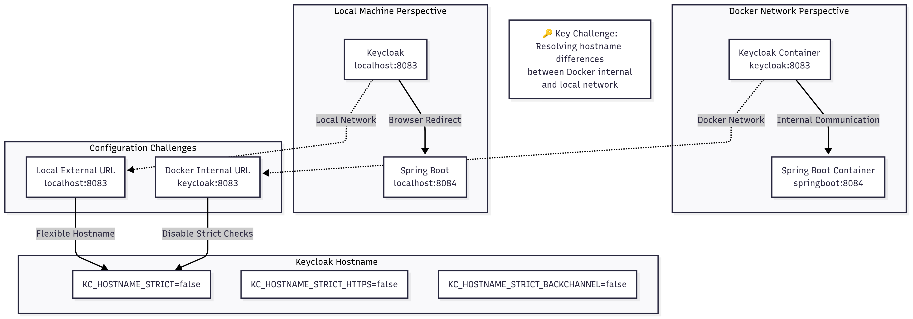

# Keycloak / Spring Boot OAuth2 연동


## 1. Situation Overview

### Feature
- Spring Boot application secured with Keycloak OAuth2 authentication
- Docker Compose setup:
  - Keycloak authentication server : 8083 port
  - Spring Boot : 8084 port

## 2. Problem Identification

Symptoms | Keycloak Authentication **redirect fails** when accessing Spring Boot from browser  
Root Cause | Incorrect hostname handling between **Docker containers and local machine**


## 3. Solution Approach
#### Keycloak Configuration
- 브라우저 localhost를 통해 접근
- 서비스 간 통신 Docker 네트워크 이름(keycloak) 사용
- 다른 2개 접근 방식을 모두 허용하기 위해 KC_HOSTNAME_STRICT=false 설정 적용
```yaml
# docker-compose.yml environment variables
- KC_HOSTNAME_STRICT=false
- KC_HOSTNAME_STRICT_HTTPS=false
- KC_HOSTNAME_STRICT_BACKCHANNEL=false
```




*Figure 1: Keycloak and Spring Boot networking interaction diagram showing Docker internal communication, local machine perspective, and configuration challenges.*


## 4. Lessons Learned and Best Practices

### Technical Insights
1. **Containerized Authentication Complexity**
   - Hostname resolution differs between container internal and external networks

2. **Flexible Configuration is Key**
   - Avoid hardcoding hostnames
   - Use environment-specific configurations
   - Implement loose hostname verification in development