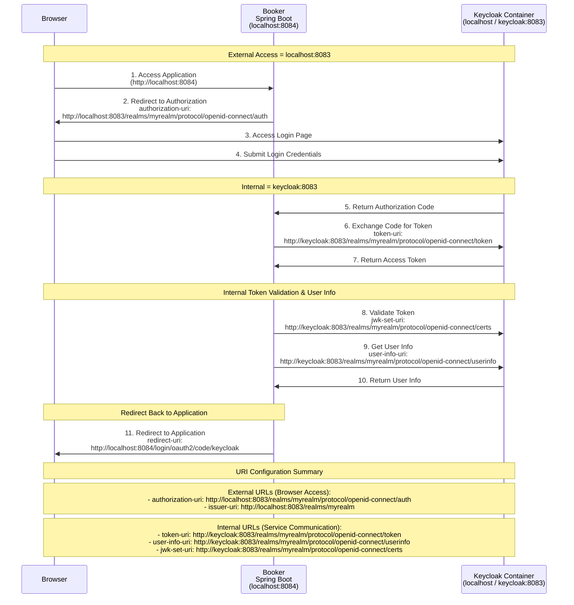

# Keycloak and Spring Boot Networking Interaction

{
  "theme": "neutral"
}

제작 사이트 
https://mermaid.live/edit#pako:eNqtVt9P2zAQ_ldOfphAapOmSZs0GkiUTRMqmyYKe5j6Yhw39ZrYmeMABfG_z05CQptqQhQ_VP5x_u7u893XPCEiIopClNO_BeWEfmE4ljhdcNAjw1IxwjLMFUwB5zCV4j6nsns6L0-FWFMJn2-lfTrPJOOx2VLl-igRBCcrkaswGATecRdiZiBmdEMSgddwLrjCjFO5cxtsWNc2BsjVQBWUpESBjG-PhqNRD15-aj9m_BCKgrjTAU57sxC-PigqOU7gjBCa5wAnsBWi296c9k9P5yE41ovtWZYljGDFBK_CWymVhba9N0cz5hphGsLQgisasTJUJeCsUCsh2WMLhF_v9AvJwnJ7H7xrS4qTNLfTTTmxMymUICKxRUY5i_pEcK4d2QZzOxedvdvkcilixuEnjmnHyLNgXtymTNVG55JGlCuGk7yypTx6L_1wwWv-T7YftL0xq2gfGdJUIfk2X7pCIrrNsIYdW_phyQrzmJYGsBQSrnVZVvwqM-vwuuX_rbSWUJ1g_TbYit7r1uwAthqySjj4hRMWVSx8ghvdkNpgKTpkBNaLJX3FwZ_7dT-n6mNYIFSqvON4YsE3qtrISjeFXvWZXn2MZwPHtrKun8AZNG-wQ817H0CDNm07xWRd9m4rAZ02d5ydPt-RC1mf_b_BPb3UXWcL08BD2-h0w1Qnn516ubm6MAq6ZHEhqzqZF2mK5WavdSOFN1eXORzVIl9X8HEVYR-62gQH61INzfK80MXxZsy9WTQ9UmUxp_KOEaMCaVrwmv4mmVYI4GARqCG36xs-orZr5NcdCwd3K-qhWLIIhUut47SHUipTbNboyfC6QGpFU7pAoZ5yWiiJkwVa8Gd9T_9P_xYiRaGShb4pRRGvGpwiM0JTfz80JrpGqTwXBVcodB2_xEDhE3pAoTdyLN8JnPFg6HhB4AY9tEGh41qu5w1GzsQbTtyR7wfPPfRYeh1Yk9HYcSe-OxmMfd8b9pDuJCXk9-obhpQVj57_AQAr3U0