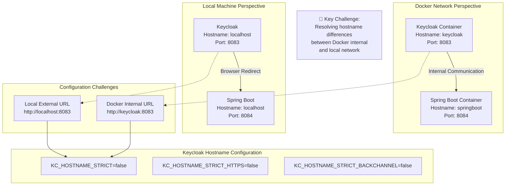

## Explanation of Networking Complexities

### Docker Network Characteristics
- Internal container communication uses container names
- Different from external/local machine access
- Requires flexible hostname configuration

### Keycloak Hostname Flexibility
- `KC_HOSTNAME_STRICT=false`: Allows multiple hostname formats
- Enables seamless communication between containers and local environment
- Prevents strict hostname verification

### Redirect URI Challenges
- Docker internal: `http://keycloak:8083`
- Local machine: `http://localhost:8083`
- Solution: Flexible redirect URI configuration

## Configuration Strategy
1. Use environment-specific hostname settings
2. Implement loose hostname verification
3. Configure multiple redirect URIs
4. Enable cross-origin authentication
```