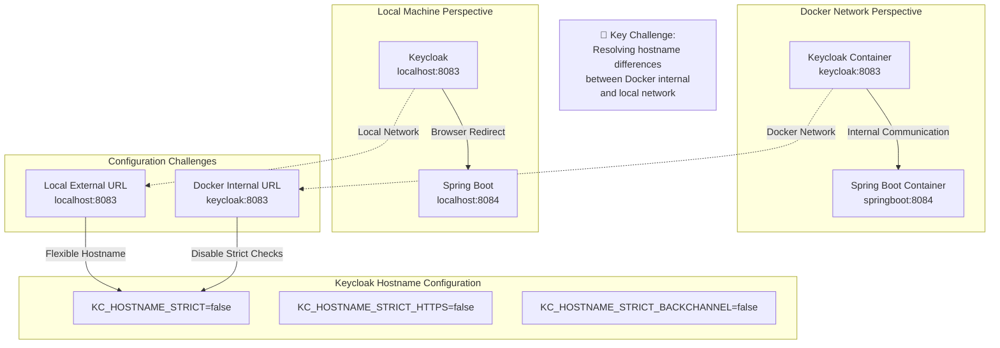

# Keycloak and Spring Boot Networking Interaction

```mermaid
graph TD
    %% Docker Network Perspective
    subgraph "Docker Network Perspective"
        A1[Keycloak Container<br>keycloak:8083] -->|Internal Communication| B1[Spring Boot Container<br>springboot:8084]
    end

    %% Local Machine Perspective
    subgraph "Local Machine Perspective"
        A2[Keycloak<br>localhost:8083] -->|Browser Redirect| B2[Spring Boot<br>localhost:8084]
    end

    %% Configuration Challenges
    subgraph "Configuration Challenges"
        C1[Docker Internal URL<br>keycloak:8083] 
        C2[Local External URL<br>localhost:8083]
    end

    %% Keycloak Hostname Configuration
    subgraph "Keycloak Hostname Configuration"
        D1[KC_HOSTNAME_STRICT=false]
        D2[KC_HOSTNAME_STRICT_HTTPS=false]
        D3[KC_HOSTNAME_STRICT_BACKCHANNEL=false]
    end

    %% Connections
    A1 -.-> |Docker Network| C1
    A2 -.-> |Local Network| C2
    C1 --> |Disable Strict Checks| D1
    C2 --> |Flexible Hostname| D1

    %% Key Challenge Note
    N1[🔑 Key Challenge:<br>Resolving hostname differences<br>between Docker internal<br>and local network]
```